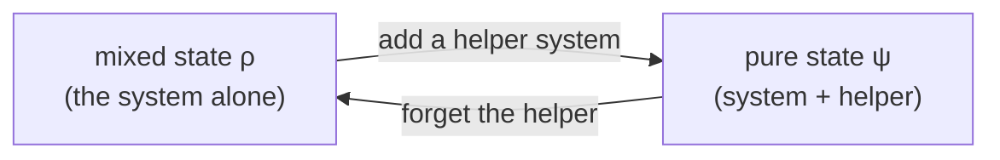
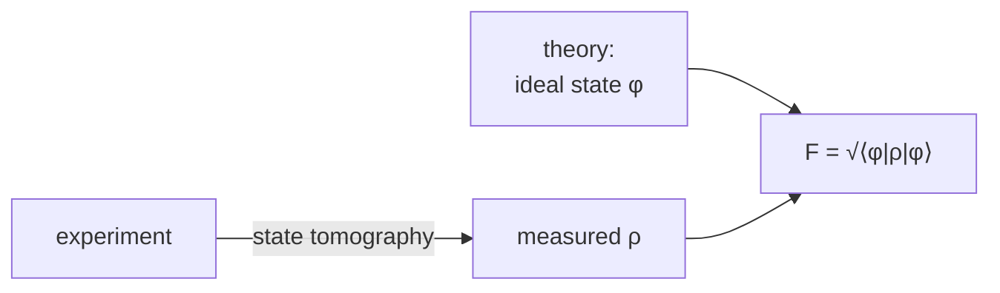

#fidelity #benchmarking #density_matrix #purification
**how close is the state you got to the state you wanted?** one number between 0 and 1, and it's used all the time to grade experiments. part of [[Benchmarking quantum systems]]
## pure states
for 2 pure states $|\psi\rangle$ and $|\phi\rangle$, the fidelity asks: **how well does $\psi$ represent $\phi$?**
$$
F=|\langle\psi|\phi\rangle|
$$
just the size of the overlap ([[Dirac notation|inner product]]) of the 2 states
> [!tip] the picture
> both states are **unit vectors** (length 1), so $F$ is the length of the "shadow" of one on the other (the projection of $\phi$ onto $\psi$, or the other way round, same thing)
> ![[Fidelity_overlap.png]]
> - $F$ close to **1** → high fidelity, almost the same state
> - $F$ close to **0** → low fidelity, almost orthogonal (totally different)
>
> on the [[Bloch sphere]], states at an angle $\Theta$ apart have $F=\cos\frac\Theta2$

> [!example] example: $|0\rangle$ vs $|+\rangle$
> $$
> F=\Big|\langle0|\tfrac1{\sqrt2}(|0\rangle+|1\rangle)\Big|=\frac1{\sqrt2}\approx0.707
> $$
> they're $90°$ apart on the Bloch sphere (checked numerically)

## watch out, 2 definitions
> [!warning] "fidelity" or "square fidelity"?
> some papers and textbooks use the **square** instead
> $$
> F^2=|\langle\psi|\phi\rangle|^2
> $$
>
> | | $F$ | $F^2$ |
> |---|---|---|
> | $\lvert0\rangle$ vs $\lvert+\rangle$ | $0.707$ | $0.5$ |
> | nice because | it matches the old **classical** fidelity of probability distributions | it's a **probability**: the chance $\phi$ passes the test "are you $\psi$?" |
>
> so always check which one someone means. "fidelity 0.9" and "square fidelity 0.9" are different claims

> [!example]- why $F$ matches the classical one
> the classical fidelity between 2 probability distributions $p$ and $q$ is $\sum_i\sqrt{p_iq_i}$
>
> put the distributions into quantum states with amplitudes $\sqrt{p_i}$ and $\sqrt{q_i}$ (probability = amplitude², see [[Probability and expectation values]]). then
> $$
> \langle\psi|\phi\rangle=\sum_i\sqrt{p_i}\sqrt{q_i}
> $$
> exactly the classical formula (checked numerically)

## noisy states (density matrices)
real experiments don't give pure states, they give a **mixed** state $\rho$ (a [[Density matrix]]). so how well does $\rho$ represent a pure state $\phi$?
$$
F(\rho,\phi)=\sqrt{\langle\phi|\rho|\phi\rangle}
$$
^mixed-fidelity

if $\rho=|\psi\rangle\langle\psi|$ is actually pure, this gives back $\sqrt{\langle\phi|\psi\rangle\langle\psi|\phi\rangle}=|\langle\psi|\phi\rangle|$ ✅
> [!example] examples
> - **fully mixed qubit** $\rho=\frac I2$: $F=\sqrt{\frac12}\approx0.707$ with **every** state. pure noise is "half right" about everything
> - **any qubit**: with Bloch vectors $\vec r$ for $\rho$ and $\vec n$ for $\phi$, $F^2=\frac{1+\vec r\cdot\vec n}2$. so after [[State tomography]] gives you $\vec r$, the fidelity is one dot product away. ($\vec r$ is the Bloch vector from here:)
>
> ![[State tomography#^bloch-vector]]
>
> (both checked numerically)

## the purification trick
> [!important] fidelity = best overlap with a purification
> ==$F(\rho,\phi)$ is also the **largest possible overlap** between the state $\phi$ and a **purification** of $\rho$==
>
> a [[Purification]] of $\rho$ is a pure state $|\psi\rangle$ on a **bigger** system (the qubit plus an extra helper system) such that **forgetting** the extra part gives back $\rho$ ([[Partial trace|tracing it out]])

eg. the fully mixed qubit $\frac I2$ is what you see if you only look at **half** of the Bell state $\frac1{\sqrt2}(|00\rangle+|11\rangle)$, so that Bell state is a purification of $\frac I2$ (same idea as the [[Schmidt decomposition]]: entanglement makes the halves look mixed)

every mixed state has many purifications, and the fidelity picks the one that lines up **best** with $\phi$ (checked numerically: a random search over purifications creeps up to $\sqrt{\langle\phi|\rho|\phi\rangle}$ and never goes above it)
> [!example]- the general formula (2 mixed states)
> between 2 density matrices $\rho$ and $\sigma$ (Uhlmann's fidelity)
> $$
> F(\rho,\sigma)=\text{tr}\sqrt{\sqrt\rho\,\sigma\sqrt\rho}
> $$
> ([[Trace]] of a matrix square root). when $\sigma=|\phi\rangle\langle\phi|$ is pure it simplifies to $\sqrt{\langle\phi|\rho|\phi\rangle}$ (checked numerically). not in the lecture, it's in the standard textbooks

## in experiments
this is the version you use all the time: $\phi$ = the ideal state from theory, $\rho$ = the noisy state you actually made

eg. a Bell state with some noise mixed in, $\rho=(1-\text{noise})\,|\phi\rangle\langle\phi|+\text{noise}\cdot\frac I4$
![[Fidelity_noisy_Bell.png]]
> [!note] 2 things to notice
> - pure noise still scores $F=0.5$ ($F^2=0.25$), **not** 0. so a fidelity of 0.5 is actually terrible for a 2 qubit state
> - $F^2$ drops faster than $F$, so the same experiment "looks worse" with the square definition. another reason to check which one a paper uses

next: using fidelities of states to grade whole **gates** ([[Process tomography]])

see also [[State tomography]], [[Density matrix]], [[Benchmarking quantum systems]]
