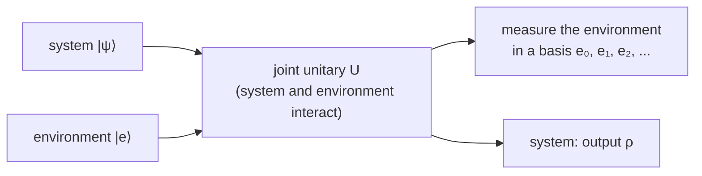

#quantum_operations #kraus_operators #quantum_channel #quantum_error_correction
the general way to describe **anything** that can happen to a quantum state (noise, measurement, gates...) as a map $\mathcal E$ from an input [[Density matrix|density matrix]] to an output one. it's the "VERY COMPLICATED" general version from [[Quantum channels]], and the language of [[Quantum Error Correction]]. part of [[Benchmarking quantum systems]]
## the goal
for error correction we first need to say what an **error** even is. so: describe **every** possible way a density matrix $\rho$ can turn into another one
$$
\rho\longrightarrow\mathcal E(\rho)
$$
not just [[Unitary Operation|unitary]] evolution ($\rho\to U\rho U^\dagger$), but **non-unitary** stuff too, like decoherence and losing energy ([[Noise Processes]])
## the model: system + environment

1. the **system** starts in a state $|\psi\rangle$
2. it doesn't evolve by itself: it's coupled to an **environment**, starting in some state $|e\rangle$ (pure here, but it doesn't have to be)
3. together they go through a **unitary** $U$. overall, nature is still unitary, it's just that some of it happens outside our system
4. afterwards the environment is **measured** in some orthonormal basis $|e_0\rangle,|e_1\rangle,\ldots$ (or just ignored, which gives the same result)
## working it out
before the measurement the joint state is $U\,|e\rangle|\psi\rangle$. if the environment's measurement gives $k$, the system is left with
$$
\langle e_k|\,U\,|e\rangle\;|\psi\rangle
$$
$\langle e_k|U|e\rangle$ only "uses up" the environment parts, so it's a **matrix that acts on the system** alone. call it
$$
E_k=\langle e_k|\,U\,|e\rangle
$$
writing $\oplus$ for "**or**" (one of these happens, at random), the output is
$$
\rho=E_0|\psi\rangle\ \oplus\ E_1|\psi\rangle\ \oplus\ E_2|\psi\rangle\ \oplus\ \ldots
$$
which, as a density matrix, is
$$
\mathcal E(\rho)=\sum_kE_k\,\rho\,E_k^\dagger
$$
^operator-sum

> [!important] the operator-sum representation
> ==any physical process on a quantum state can be written as $\mathcal E(\rho)=\sum_kE_k\,\rho\,E_k^\dagger$==, where the $E_k$ satisfy
> $$
> \sum_kE_k^\dagger E_k=I
> $$
> the $E_k$ are called **operation elements**, **Kraus operators**, or (in error correction) **error operators**

## why $\sum E_k^\dagger E_k=I$
plug in the definition
$$
\sum_kE_k^\dagger E_k=\sum_k\langle e|U^\dagger|e_k\rangle\langle e_k|U|e\rangle=\langle e|\,U^\dagger\Big(\sum_k|e_k\rangle\langle e_k|\Big)U\,|e\rangle
$$
the $|e_k\rangle$ are a complete basis of the environment, so the middle sum is the identity ($\sum_k|e_k\rangle\langle e_k|=I$). then $U^\dagger U=I$ and $\langle e|e\rangle=1$, leaving
$$
\sum_kE_k^\dagger E_k=I\ ✅
$$
this is what makes the probabilities add up to 1: the chance of outcome $k$ is $\text{tr}(E_k\rho E_k^\dagger)$, and these always sum to $\text{tr}\,\rho=1$ (**trace preserving**)
## example: building a channel from an environment
> [!example] the system controls a small rotation of the environment
> environment starts in $|0\rangle$. if the system is $|1\rangle$, the environment gets rotated a bit, by $R_y(\theta)$. reading off $E_k=\langle k|U|0\rangle$
> $$
> E_0=\begin{bmatrix}1&0\\0&\cos\frac\theta2\end{bmatrix}\qquad E_1=\begin{bmatrix}0&0\\0&\sin\frac\theta2\end{bmatrix}
> $$
> - the off diagonals of $\rho$ get multiplied by $\cos\frac\theta2$, the diagonal stays the same: it's [[Dephasing channel|dephasing]] (the [[Phase damping channel]] with $\lambda=\sin^2\frac\theta2$)
> - $\theta=\pi$ makes it a [[CNOT gate|CNOT]] into the environment: $E_0=|0\rangle\langle0|$, $E_1=|1\rangle\langle1|$, which **completely** dephases the qubit. the environment "measured" it
>
> (checked numerically: same answer as simulating system + environment together and then forgetting the environment with a [[Partial trace]])

so dephasing just means: ==the environment learned a little bit about whether the qubit is $|0\rangle$ or $|1\rangle$==
## the channels you already know

| channel | operation elements |
|---|---|
| a unitary gate | just one: $E_0=U$ |
| [[Dephasing channel]] | $\sqrt{1-p}\,I,\ \sqrt p\,Z$ |
| [[Depolarizing channel]] | $\sqrt{1-p}\,I,\ \sqrt{\frac p3}\,X,\ \sqrt{\frac p3}\,Y,\ \sqrt{\frac p3}\,Z$ |
| [[Bit flip channel]] | $\sqrt{1-p}\,I,\ \sqrt p\,X$ |
| [[Amplitude damping channel]] | the 2 below |

![[Amplitude damping channel#^kraus]]

> [!tip] "mixture of gates" is a special case
> a channel that's a mixture of gates (gate $U_k$ with probability $p_k$) just has $E_k=\sqrt{p_k}\,U_k$. amplitude damping **isn't** like that ($E_1$ isn't a scaled unitary), which is why it needed this general form

## why this matters for error correction
- the errors that hit a qubit are exactly the $E_k$. eg. dephasing = "nothing happened" ($I$) **or** "a $Z$ happened"
- [[Quantum Error Correction]] works by detecting **which** $E_k$ happened and undoing it
- and to benchmark a real gate, [[Process tomography]] measures its whole map $\mathcal E$

see also [[Quantum channels]], [[Density matrix]], [[Partial trace]], [[Quantum Error Correction]]
