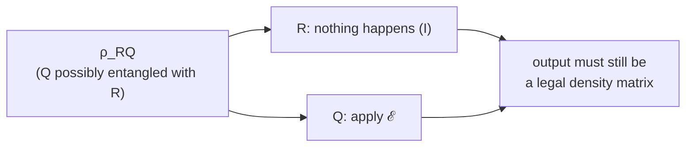

#quantum_operations #CPTP #complete_positivity #quantum_channel
the formal rules for what counts as a **legal** map $\rho\to\mathcal E(\rho)$ in quantum mechanics. follows on from [[Operator-sum representation]], part of [[Benchmarking quantum systems]]
## the 3 rules
==a map $\mathcal E$ is a valid quantum operation if and only if it's trace preserving, convex-linear and completely positive==

| rule | in maths | why |
|---|---|---|
| **1. trace preserving** | $\text{tr}\,\mathcal E(\rho)=1$ | the output has to be a real [[Density matrix\|density matrix]] (probabilities add to 1) |
| **2. convex-linear** | $\mathcal E\big(\sum_ip_i\rho_i\big)=\sum_ip_i\,\mathcal E(\rho_i)$ | a mixture going in gives the same mixture of outputs. quantum mechanics is a **linear** matrix theory |
| **3. completely positive** | $(I_R\otimes\mathcal E)(\rho_{RQ})\geq0$ for **any** extra system $R$ | the output must be a legal (positive) state, **even if $\mathcal E$ only acts on part of a bigger system** |

rules 1 and 2 are natural. rule 3 is the surprising one
> [!important] the big theorem
> a map follows all 3 rules **exactly when** it can be written in [[Operator-sum representation|operator-sum form]]
> 
> ![[Operator-sum representation#^operator-sum]]
> 
> with $\sum_kE_k^\dagger E_k=I$. so "CPTP map" (completely positive trace preserving), "quantum channel" and "quantum operation" all mean the same thing

## complete positivity
**positive** = a positive matrix (a legal state, no negative eigenvalues) goes in, a positive matrix comes out. it's natural to want that, but it's **not enough**

your qubit $Q$ might be entangled with some other **reference** system $R$ (another qubit, the lab, anything). $\mathcal E$ only touches $Q$, nothing happens to $R$, and the **whole** thing still has to come out as a legal state

==**completely positive** = positive even when acting on just part of a bigger system==. that's a much stronger condition than just positive
## the transpose example (positive, but not completely positive)
the map that **transposes** a qubit's density matrix (swaps the off diagonal elements)
$$
\begin{bmatrix}a&b\\c&d\end{bmatrix}\longrightarrow\begin{bmatrix}a&c\\b&d\end{bmatrix}
$$
- on its own it's fine: a transposed matrix has the **same eigenvalues**, so legal states stay legal ✅ (positive, checked numerically on random states)
- now apply it to **only the second qubit** of a 2 qubit state ($I\otimes T$). that's the **partial transpose**: it swaps the off diagonals inside each $2\times2$ quarter of the $4\times4$ matrix

try it on the [[Bell states|Bell state]] $\frac1{\sqrt2}(|00\rangle+|11\rangle)$
$$
\rho=\frac12\begin{bmatrix}1&0&0&1\\0&0&0&0\\0&0&0&0\\1&0&0&1\end{bmatrix}\quad\longrightarrow\quad\frac12\begin{bmatrix}1&0&0&0\\0&0&1&0\\0&1&0&0\\0&0&0&1\end{bmatrix}
$$
> [!danger] looks legal, isn't
> just 0s and 1s, trace 1... but the middle block $\frac12\begin{bmatrix}0&1\\1&0\end{bmatrix}$ has eigenvalue $-\frac12$ (checked numerically). a negative eigenvalue = a negative probability, so this is **not** a density matrix
>
> so the transpose is **positive but not completely positive**: it can't happen physically

even though it's unphysical, the partial transpose is a really useful maths tool: it's a **test for entanglement**, see [[Partial transpose]]
## the channels you already know pass
every channel in [[Quantum channels]] ([[Dephasing channel|dephasing]], [[Depolarizing channel|depolarizing]], [[Amplitude damping channel|amplitude damping]]...) is written with Kraus operators that add up to $I$, so by the big theorem they're all automatically completely positive and trace preserving

see also [[Operator-sum representation]], [[Partial transpose]], [[Quantum channels]], [[Density matrix]]
