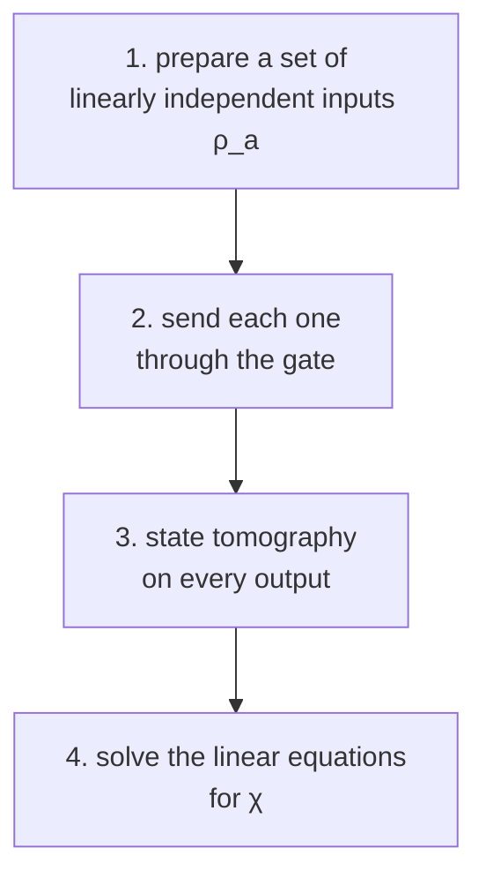

#tomography #process_tomography #benchmarking #quantum_operations
[[State tomography]] works out what **state** you made. **process tomography** does the same for a **gate**: what quantum operation is the hardware **actually** doing? vital for testing quantum computers. part of [[Benchmarking quantum systems]]
## the goal
any process can be written in [[Operator-sum representation|operator-sum form]]

![[Operator-sum representation#^operator-sum]]

so the job is to find the operation elements $E_k$ (they're matrices)
## the χ matrix
expand each $E_k$ in a fixed set of matrices, the (generalized) **Pauli matrices** $\sigma_j$ ($I,X,Y,Z$ for 1 qubit)
$$
E_k=\sum_jc_{kj}\,\sigma_j
$$
(the $c_{kj}$ are just numbers, complex in general). plug that in and everything collapses into one matrix of numbers
$$
\mathcal E(\rho)=\sum_{m,n}\chi_{mn}\,\sigma_m\,\rho\,\sigma_n^\dagger\qquad\chi_{mn}=\sum_kc_{km}\,c_{kn}^*
$$
^chi-matrix

==the goal of process tomography is to find this **χ matrix**==. it completely describes the gate
> [!example] χ for an X gate
> a perfect X gate has just one non-zero entry, $\chi_{XX}=1$. if it also has depolarizing noise $p$ (an extra random $X$, $Y$ or $Z$ each with probability $\frac p3$), the big bar shrinks to $1-p$ and 3 small ones appear (picture below)
>
> handy link to [[Gate fidelity]]: when the ideal gate is a Pauli, its χ entry **is** the entanglement fidelity, here $\chi_{XX}=F_e=1-p$ (checked numerically)

## how many numbers?
if the system has dimension $d$, χ has
$$
d^4-d^2
$$
free parameters. for $n$ qubits ($d=2^n$) that's $2^{4n}-2^{2n}$

| qubits | parameters |
|---|---|
| 1 | 12 |
| 2 | 240 |
| 3 | 4,032 |
| 5 | about 1 million |
| 10 | about $10^{12}$ |

for 1 qubit: **3** of the 12 describe which unitary gate it is, the other **9** describe decoherence and damping. ==there are many more ways to decohere and damp than to be a perfect gate==

## the 4 steps (standard process tomography)

1. **prepare** a basis of linearly independent input states $\rho_a$ (eg. for 1 qubit: $|0\rangle,|1\rangle,|+\rangle,|{+i}\rangle$, which span all $2\times2$ matrices)
2. **send** each one through the apparatus. the output $\mathcal E(\rho_a)$ depends linearly on χ
3. **measure** each output with [[State tomography]], and write the result in terms of the basis states (numbers $c_{ab}$)
4. **invert** the linear equations linking the $c_{ab}$ to χ → you have χ

![[Process_tomography_chi.png]]
(my simulation: the noisy gate's χ rebuilt from 4 inputs × 3 measurement axes × 1000 shots each. close to the true one, but not exact: $\chi_{XX}\approx0.89$ instead of $0.90$)
## the problems
> [!warning] why it's hard
> - **exponential growth**: the number of parameters explodes (see the table), and so does the number of experiments: $4^n$ inputs × $3^n$ measurement settings (12 for 1 qubit, 144 for 2)
> - **noisy data**: state tomography is statistics with finite shots, so the inversion amplifies the noise
> - **illegal answers**: that noise can give a χ that isn't a real quantum operation, because it breaks being completely positive and trace preserving ([[Quantum operations]]). in my simulation about **15%** of runs gave a χ with a negative eigenvalue, from shot noise alone

## the fixes
- **maximum likelihood**: find the **closest legal** χ that best explains the data
- **constrained inversion**: only allow answers that are completely positive and trace preserving
- **prior information**: if you already know a lot about the gate (eg. that it's close to an X), far fewer parameters need measuring

today process tomography and its variants are among the most important diagnostic tools in quantum computing labs. for many qubits, cheaper methods like [[Randomized benchmarking]] give one overall error number instead of the whole χ

see also [[State tomography]], [[Gate fidelity]], [[Operator-sum representation]], [[Quantum operations]]
