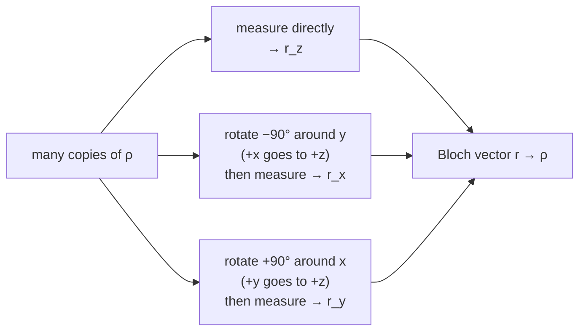

#tomography #state_tomography #benchmarking #bloch_sphere
how to **experimentally figure out** what quantum state you actually made. at the heart of debugging real quantum computers. part of [[Benchmarking quantum systems]]
## the question
> [!question] given lots of copies of a qubit in some unknown state $\rho$, how do you find out what $\rho$ is?
> remember on the [[Bloch sphere]]
> - **surface** = pure states (like $|0\rangle$, $|1\rangle$, $|+\rangle$)
> - **inside** = mixed states ([[Density matrix|density matrices]])
> - **centre** = $\frac I2$, the equal mix of $|0\rangle$ and $|1\rangle$
>
> so the question is really: **where in the ball is $\rho$?**
## the key idea: the Bloch vector
every single qubit density matrix can be written with the identity and the 3 Pauli matrices ([[X gate|σx]], [[Y gate|σy]], [[Z gate|σz]])
$$
\rho=\frac{I+\vec r\cdot\vec\sigma}2=\frac{I+r_x\sigma_x+r_y\sigma_y+r_z\sigma_z}2
$$
^bloch-vector

$\vec r=(r_x,r_y,r_z)$ is the **Bloch vector**: the point in the ball. so you just need to measure its 3 numbers
> [!important] each component is an expectation value
> $$
> r_x=\langle\sigma_x\rangle\qquad r_y=\langle\sigma_y\rangle\qquad r_z=\langle\sigma_z\rangle
> $$
> eg. $r_z=\langle\sigma_z\rangle=\text{tr}(\rho\,\sigma_z)=\rho_{00}-\rho_{11}$, just the "up minus down" part of $\rho$ (see [[Probability and expectation values]] and [[Trace]])

> [!example]- proof
> plug $\rho=\frac{I+\vec r\cdot\vec\sigma}2$ into $\text{tr}(\rho\,\sigma_z)$
> $$
> \text{tr}(\rho\,\sigma_z)=\frac12\Big(\text{tr}(\sigma_z)+r_x\text{tr}(\sigma_x\sigma_z)+r_y\text{tr}(\sigma_y\sigma_z)+r_z\text{tr}(\sigma_z\sigma_z)\Big)
> $$
> all the Pauli products are **traceless** except $\sigma_z\sigma_z=I$, and $\text{tr}(I)=2$, so everything cancels except
> $$
> \text{tr}(\rho\,\sigma_z)=\frac12\,r_z\cdot2=r_z\ ✅
> $$
> (in general $\text{tr}(\sigma_i\sigma_j)=2$ if $i=j$ and $0$ otherwise, checked numerically)
## how to measure each one
quantum computers can only measure along $z$ (in the $|0\rangle,|1\rangle$ basis), so to measure the other axes you **rotate** that axis onto $z$ first

each measurement just gives 0 or 1, so you repeat it lots of times: $\langle\sigma_z\rangle=P(0)-P(1)=1-2P(1)$

(checked numerically: rotating by those angles really does turn $r_x$ and $r_y$ into $\langle\sigma_z\rangle$)
> [!warning] it's statistics
> each axis is estimated from a finite number of shots $N$, so the answer is never exact. the error only shrinks like $\frac1{\sqrt N}$
> ![[Tomography_shots.png]]
> (my simulation: 100× more measurements only makes it 10× more accurate)
## more qubits
single qubit tomography was worked out in the **1950s** for NMR (nuclear magnetic resonance), but it really becomes useful for **many qubits**

for 2 qubits, $\rho$ is a sum of [[Tensor product|tensor products]] of Paulis
$$
\rho=\frac14\sum_{i,j\in\{I,x,y,z\}}r_{ij}\;\sigma_i\otimes\sigma_j
$$
rotate **each** qubit before measuring: 3 choices per qubit, so $3\times3=$ **9 measurement settings**

| qubits | numbers to find ($4^n-1$) | measurement settings ($3^n$) |
|---|---|---|
| 1 | 3 | 3 |
| 2 | 15 | 9 |
| 10 | about a million | 59,049 |

(it grows **exponentially**, the overhead problem later this week)
## a real experiment
2003, **Rainer Blatt's group** in Innsbruck: 2 trapped ions in the entangled state $\frac1{\sqrt2}(|SS\rangle+|DD\rangle)$ (S and D are the 2 levels of each ion, like $|0\rangle$ and $|1\rangle$), one of the first state tomographies of a well controlled multi qubit system
- **real part**: 4 equal non-zero bars in the corners. the **off-diagonal** corners are the signature of **entanglement**
- **imaginary part**: zero (within experimental error)

here's the same thing for $\frac1{\sqrt2}(|00\rangle+|11\rangle)$ from my simulation (9 settings × 1000 shots each)
![[Bell_state_tomography.png]]
> [!note] why the [[State fidelity|fidelity]] is exactly 1 here
> for this state the 3 measurements that decide the fidelity ($XX$, $YY$, $ZZ$) always give the same answer, so shot noise can't touch them. the noise shows up in the other entries instead (the tiny bars)

since then, tomography has been done on much bigger quantum systems, and it's still a basic tool for diagnosing states in quantum computers

(the transcript says "telegraphic measurements", it means **tomographic**)

see also [[Process tomography]], [[Benchmarking quantum systems]], [[Density matrix]]
