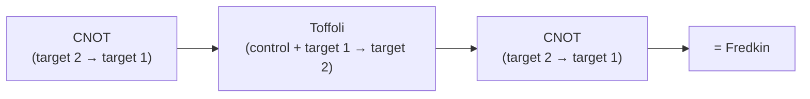

#extra #gate #controlled_gate #fredkin_gate
**extra** (not in the course): the **controlled-SWAP** gate. a 3 qubit gate, cousin of the [[Toffoli gate]]
## what it does
- control $|0\rangle$ → nothing happens
- control $|1\rangle$ → [[SWAP gate|swap]] the other 2 qubits

| input | output |
|---|---|
| $\lvert000\rangle$ | $\lvert000\rangle$ |
| $\lvert011\rangle$ | $\lvert011\rangle$ (control is 0) |
| $\lvert101\rangle$ | $\lvert110\rangle$ (swapped) |
| $\lvert110\rangle$ | $\lvert101\rangle$ (swapped) |
| $\lvert111\rangle$ | $\lvert111\rangle$ (swapping 1 and 1 changes nothing) |

(checked numerically). as a matrix it's the $8\times8$ identity with rows 5 and 6 (the $|101\rangle$ and $|110\rangle$ rows) swapped
## circuit

(same idea as building a SWAP out of 3 CNOTs, but the middle one gets the extra control)
```visual
q0: ──●──
      │
q1: ──x──
      │
q2: ──x──
```
## why it's interesting
- **reversible**: it's its own inverse (do it twice = nothing)
- **universal for classical logic**: like the Toffoli, you can build any classical circuit out of Fredkin gates alone (eg. with the target set to fixed values you get AND, OR, NOT)
- **conserves the number of 1s**: it only moves bits around, never creates or destroys a 1. that's why it's used in "billiard ball" models of computing
- **the swap test**: a Hadamard on the control, a Fredkin, another Hadamard and a measurement tells you how similar 2 states are: $P(0)=\frac12+\frac12|\langle\psi|\phi\rangle|^2$ (see [[State fidelity]])
## Qiskit implementation
```python
from qiskit import QuantumCircuit
qc = QuantumCircuit(3)
qc.cswap(0, 1, 2)
```

see also [[Toffoli gate]], [[SWAP gate]], [[Multiqubit gates]]
