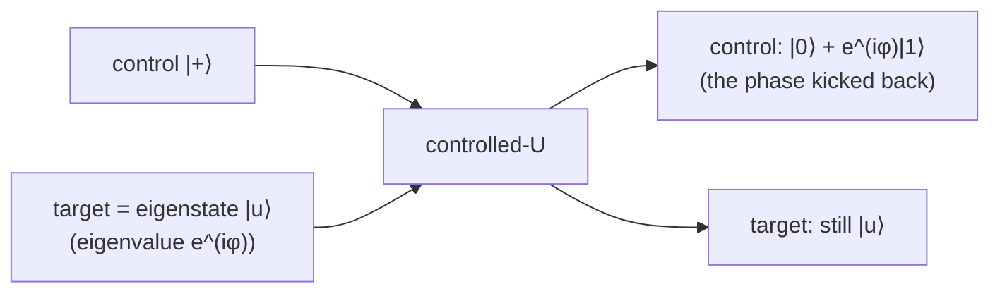

#extra #phase_kickback #controlled_gate #phase
**extra** (not in the course): how a controlled gate can change the **control** qubit instead of the target. the trick inside [[Quantum Phase Estimation]], [[Shor's algorithm]] and [[Grover's algorithm]]
## the idea
if the target is already an **eigenstate** of the gate ([[Eigenvalues and eigenvectors]])
$$
U|u\rangle=e^{i\varphi}|u\rangle
$$
then a controlled-$U$ can't change the target (it only picks up a number). but that number, the phase, ends up on the **control**
$$
\text{C-}U\;\frac{|0\rangle+|1\rangle}{\sqrt2}|u\rangle=\frac{|0\rangle+e^{i\varphi}|1\rangle}{\sqrt2}|u\rangle
$$
the target is untouched, and the control got a relative phase $e^{i\varphi}$

## examples

| gate | target | control before → after |
|---|---|---|
| [[CZ gate\|CZ]] | $\lvert1\rangle$ ($Z$ eigenvalue $-1$) | $\lvert+\rangle\to\lvert-\rangle$ |
| [[CNOT gate\|CNOT]] | $\lvert-\rangle$ ($X$ eigenvalue $-1$) | $\lvert+\rangle\to\lvert-\rangle$ |

(both checked numerically). so the "target" doesn't change and the "control" flips from $|+\rangle$ to $|-\rangle$, the opposite of what you'd expect
## where it's used
- **[[Quantum Phase Estimation]]**: controlled-$U^{2^j}$ gates kick $e^{2\pi i\,2^j\theta}$ back onto the counting qubits, then the inverse QFT reads $\theta$
- **oracles** in [[Grover's algorithm]], [[Simon's algorithm]] and [[Bernstein-Vazirani algorithm|Bernstein–Vazirani]]: put the helper qubit in $|-\rangle$, and an oracle that flips it when $f(x)=1$ gives $(-1)^{f(x)}$ as a phase on $|x\rangle$ instead

see also [[Quantum Phase Estimation]], [[CZ gate]], [[CNOT gate]]
