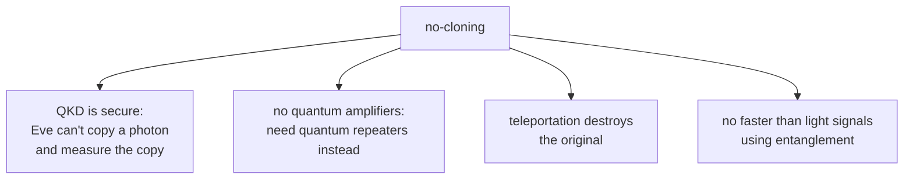

#extra #no_cloning #quantum_information #QKD
**extra** (not covered as its own lesson): you **can't make a perfect copy of an unknown quantum state**. behind [[QKD]] security, [[Teleportation]], and why quantum signals can't be amplified
## the statement
there's no machine (unitary $U$) that does
$$
U\,|\psi\rangle|0\rangle=|\psi\rangle|\psi\rangle
$$
for **every** state $|\psi\rangle$ (Wootters, Zurek and Dieks, 1982)
## the proof (3 lines)
say it worked for 2 states $|\psi\rangle$ and $|\phi\rangle$
$$
U|\psi\rangle|0\rangle=|\psi\rangle|\psi\rangle\qquad U|\phi\rangle|0\rangle=|\phi\rangle|\phi\rangle
$$
unitaries keep inner products the same ([[Math/Dirac notation]]), so take the inner product of the 2 lines
$$
\langle\psi|\phi\rangle\cdot\langle0|0\rangle=\langle\psi|\phi\rangle^2\quad\Rightarrow\quad\langle\psi|\phi\rangle=\langle\psi|\phi\rangle^2
$$
so $\langle\psi|\phi\rangle$ is $0$ or $1$: the states are either **the same** or **orthogonal**. a copier can only copy states from one fixed orthogonal set, never all of them
## example: CNOT as a copier
a [[CNOT gate]] with the target starting at $|0\rangle$ copies $|0\rangle$ and $|1\rangle$ fine
$$
|0\rangle|0\rangle\to|0\rangle|0\rangle\qquad|1\rangle|0\rangle\to|1\rangle|1\rangle
$$
but for $|+\rangle$ it makes a [[Bell states|Bell state]], **not** 2 copies
$$
|+\rangle|0\rangle\to\frac{|00\rangle+|11\rangle}{\sqrt2}\ne|+\rangle|+\rangle=\frac{|00\rangle+|01\rangle+|10\rangle+|11\rangle}2
$$
(checked numerically)
## why it matters

- [[QKD]]: Eve can't keep a perfect copy of each photon to measure later
- [[Long-distance quantum communication]]: classical signals get amplified along a fibre, quantum ones can't, so you need [[Quantum repeaters]]
- [[Teleportation]]: the state moves, but the original is destroyed, so there's never 2 copies
- if you **could** clone, you could copy your half of an entangled pair many times, measure to tell which basis the other side used, and send signals faster than light
> [!tip] imperfect copies are allowed
> you can make **approximate** copies. the best universal cloner for qubits makes 2 copies each with [[State fidelity|fidelity]] $\frac56$ (Bužek and Hillery, 1996)

> [!note] you CAN copy classical information
> if you know the state is $|0\rangle$ or $|1\rangle$ (orthogonal), copying is fine, that's just classical bits. it's **unknown superpositions** that can't be copied

see also [[QKD]], [[Teleportation]], [[Quantum repeaters]], [[Bell states]]
