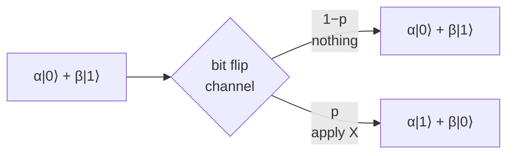

#extra #quantum_channel #bit_flip #bloch_sphere
**extra** (not in the course): the qubit randomly gets an [[X gate|X]] (a bit flip). the most direct quantum copy of the classical [[Binary symmetric channel]]
## what it does
- probability $1-p$ → nothing
- probability $p$ → apply $X$ ($|0\rangle\leftrightarrow|1\rangle$)
$$
\rho\longrightarrow(1-p)\,\rho+p\,X\rho X
$$

## example
$|0\rangle$ goes in, a classical mix comes out
$$
\begin{bmatrix}1&0\\0&0\end{bmatrix}\longrightarrow\begin{bmatrix}1-p&0\\0&p\end{bmatrix}
$$
exactly like the binary symmetric channel: a 0 becomes a 1 with probability $p$

but $|+\rangle$ and $|-\rangle$ **don't change at all**: they're eigenstates of $X$, so flipping does nothing to them
## on the Bloch sphere
$$
(r_x,r_y,r_z)\longrightarrow\big(r_x,\ (1-2p)r_y,\ (1-2p)r_z\big)
$$
the $x$ axis survives, $y$ and $z$ shrink. it's the [[Dephasing channel]] turned on its side (see the picture in [[Pauli channel]])
> [!tip] same channel, different basis
> a bit flip in the $|0\rangle,|1\rangle$ basis is a phase flip in the $|+\rangle,|-\rangle$ basis, because $X=HZH$ ([[Hadamard Gate]]). that's why the 3 qubit **bit flip code** and **phase flip code** in error correction are the same code with Hadamards around it

see also [[Pauli channel]], [[Binary symmetric channel]], [[Dephasing channel]]
