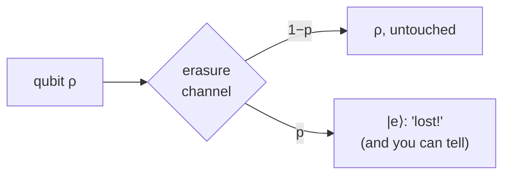

#extra #quantum_channel #erasure #photon_loss
**extra** (not in the course): the qubit sometimes gets **lost**, but you **know** when it happened
## what it does
- probability $1-p$ → the qubit arrives untouched
- probability $p$ → it's replaced by a special "erased" flag $|e\rangle$, a third state that's orthogonal to $|0\rangle$ and $|1\rangle$
$$
\rho\longrightarrow(1-p)\,\rho+p\,|e\rangle\langle e|
$$

## why it's the "nice" kind of error
the receiver can check whether the qubit is $|e\rangle$ without disturbing it. so you always know **which** qubits are bad, which makes errors much easier to fix than random unknown flips

| | known where the error is? | quantum capacity |
|---|---|---|
| erasure channel | yes | $1-2p$ (for $p<\frac12$) |
| [[Depolarizing channel]] (same $p$) | no | lower |

(the classical capacity is $1-p$: you just lose the erased bits. compare [[Channel capacity]])
> [!example] real life: photon loss
> a photon lost in a fibre is basically an erasure: the detector just doesn't click, so you know it didn't arrive. that's why losing photons in [[QKD]] only lowers the **rate** instead of breaking security (see [[QKD distance and key rate]])

> [!note] the 50% limit again
> at $p=\frac12$ the quantum capacity hits 0. if half the qubits are lost, the environment could have as much as the receiver, and [[No-cloning theorem|no-cloning]] says you can't both have it. same reason as the 50% limit in [[Quantum repeaters]]

see also [[Quantum channels]], [[Channel capacity]], [[QKD distance and key rate]]
