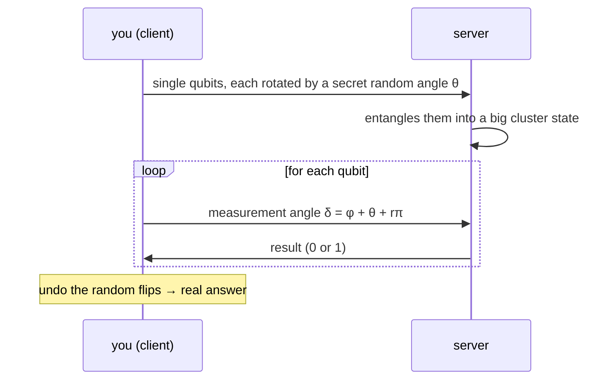

#extra #blind_quantum_computing #cloud #security
**extra** (not in the course): run a program on someone else's quantum computer in the cloud, **without them learning what you're computing**, what the input is, or what the answer is
## the problem
quantum computers will mostly be big shared machines in the cloud. if you send a normal circuit, the owner sees everything. can you hide it and still use their machine?
## the idea (Broadbent, Fitzsimons and Kashefi, 2009)
it's built on **measurement based** quantum computing: make a big entangled "cluster state", then compute just by measuring the qubits one by one at chosen **angles**. the angles **are** the program

- $\varphi$ = the angle your program actually needs
- $\theta$ = a secret random rotation you put on the qubit when you sent it (one of 8 angles, multiples of $\frac\pi4$)
- $r$ = a secret random bit that flips the result
## why the server learns nothing
every angle $\delta$ the server sees looks **completely random**, because it's hidden by $\theta$ (like a [[One-time pad]] on angles). and every result is randomly flipped by $r$. only you know $\theta$ and $r$, so only you can decode the real program and answer
> [!tip] you only need a tiny bit of quantum
> the client just has to **prepare single qubits** (or even just send photons). no quantum computer of your own. first done with photons in 2012

> [!note] verifying the answer too
> hide a few **trap** qubits whose results you already know. if the server cheats or makes errors, the traps catch it

see also [[Distributed quantum computing]], [[One-time pad]], [[Long-distance quantum communication]]
