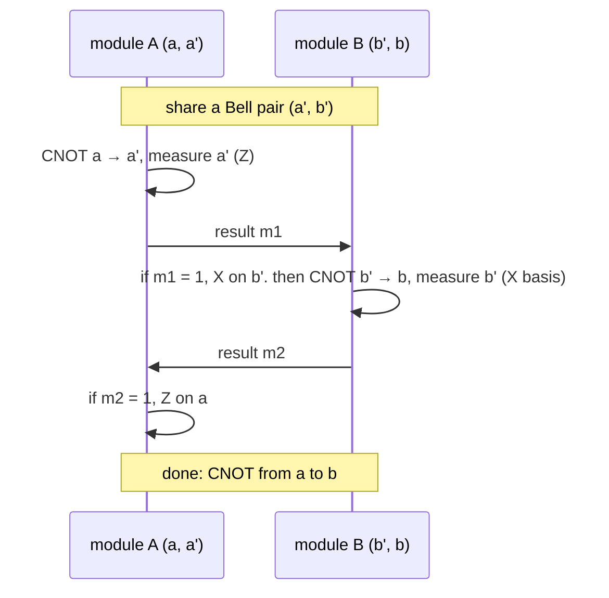

#extra #distributed_quantum_computing #entanglement #quantum_internet
**extra** (not in the course): link several **smaller** quantum computers into one **bigger** one, using shared entanglement. one of the uses of a quantum internet ([[Long-distance quantum communication]])
## why
building one huge chip with millions of qubits is really hard (wiring, cooling, crosstalk). connecting modules is easier, as long as qubits in **different** modules can still do gates together
## the trick: a remote CNOT
qubit $a$ is in module A, qubit $b$ in module B, and they share a [[Bell states|Bell pair]] $(a',b')$. with **1 ebit + 2 classical bits** you can do a CNOT from $a$ to $b$ without ever moving them

(checked numerically for all 4 measurement outcomes, with random starting states)

it's like [[Teleportation]], but it teleports a **gate** instead of a state. CNOT + single qubit gates is universal ([[Quantum gate]]), so any circuit can be split across modules
> [!tip] the cost
> every gate between modules uses up **one Bell pair**. so the links need to make entanglement fast and with high [[State fidelity|fidelity]] (with [[Entanglement purification]] if needed), and each module needs a [[Quantum memory]] to hold pairs until they're used

> [!info] real demos
> trapped ion modules linked by photons have already run small algorithms split across 2 separate machines (eg. Oxford, 2025), and big companies' roadmaps rely on linking modules

see also [[Teleportation]], [[Quantum memory]], [[Entanglement as a resource]], [[Blind quantum computing]]
