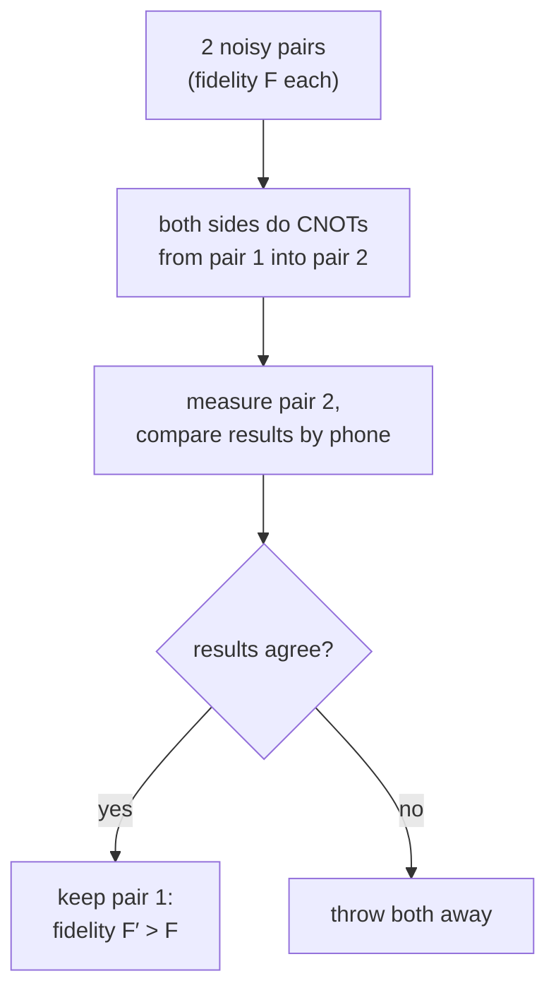

#extra #entanglement_purification #entanglement #quantum_repeater
**extra** (the course only mentions it): turn several **noisy** entangled pairs into fewer **better** ones, using only local operations and normal communication. one of the 3 key ideas of [[Quantum repeaters]]
## the problem
entangled pairs sent over a fibre, or joined by entanglement swapping, come out **noisy**: instead of a perfect $|\Phi^+\rangle$ you get a mix with [[State fidelity|fidelity]] $F<1$. swapping noisy links makes them even worse, so a long repeater chain would end up with useless entanglement
## the recurrence protocol (Bennett et al. 1996)

1. Alice and Bob each take their halves of 2 pairs
2. each does a [[CNOT gate|CNOT]] from pair 1 into pair 2 on their side
3. they measure pair 2 and tell each other the results (classical communication)
4. if the results **match**, pair 1 is kept and is now **more** entangled. if not, both are thrown away

for **Werner** pairs (a Bell state mixed with the other 3 equally), one round gives
$$
F'=\frac{F^2+\left(\frac{1-F}3\right)^2}{F^2+\frac23F(1-F)+\frac59(1-F)^2}
$$
(the bottom is the chance of success)
![[Entanglement_purification.png]]
- it only helps when $F>\frac12$. below that there's too little entanglement to distil
- each round uses up **half** the pairs (plus the failures), so getting very high fidelity costs a lot of pairs
- eg. $F=0.8$ → $0.838$ → $0.874$ → $0.905$ → ... (success chance about 77% in the first round, checked numerically)
> [!important] why it works at all
> you can't **create** entanglement with local operations and classical communication ([[LOCC]]), but you can **concentrate** it: sacrifice some pairs to learn about the errors in others and keep only the good ones. it's closely related to [[Quantum Error Correction]]

see also [[Quantum repeaters]], [[Entanglement as a resource]], [[State fidelity]], [[Bell states]]
