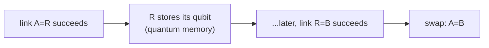

#extra #quantum_memory #quantum_repeater #quantum_internet
**extra** (not in the course): a device that **stores** a quantum state (often one carried by a photon) and gives it back later, without measuring it. the part [[Quantum repeaters]] are waiting for
## why repeaters need it
entanglement links succeed at **random** times (most photons get lost). a node has to **hold** its half of a successful link until the neighbouring link succeeds too, and until the classical messages have travelled back and forth

without memory, **every** link would have to succeed at the same moment, and the chance of that shrinks exponentially with the number of links
## what makes a good one

| property | what it means |
|---|---|
| **storage time** | how long the state stays coherent. has to beat the round trip time for messages (eg. about 1 ms per 100 km of fibre) |
| **efficiency** | the chance you actually get the photon back out |
| **fidelity** | how close the state you get back is to what went in ([[State fidelity]]) |
| **multimode** | store many photons at once (different times or colours), which massively speeds up repeaters |
| **wavelength** | ideally works with telecom light (~1550 nm) or can convert to it |

## the main platforms
- **atomic ensembles**: clouds of cold atoms that absorb and re-emit light (used in the DLCZ repeater, idea 3 in [[Quantum repeaters]])
- **rare earth ions in crystals**: solid state, very long coherence times (up to hours in special cases), lots of modes
- **single atoms, ions, or defects in diamond** (like NV and SiV centres): store the state in one very well controlled system, easy to do gates on
> [!note] a quantum memory is basically a tiny quantum computer
> the repeater requirements (~100 qubits per node, ~100 ms memories) are why people say quantum repeaters and quantum computers need the same hardware progress

see also [[Quantum repeaters]], [[Long-distance quantum communication]], [[Distributed quantum computing]]
