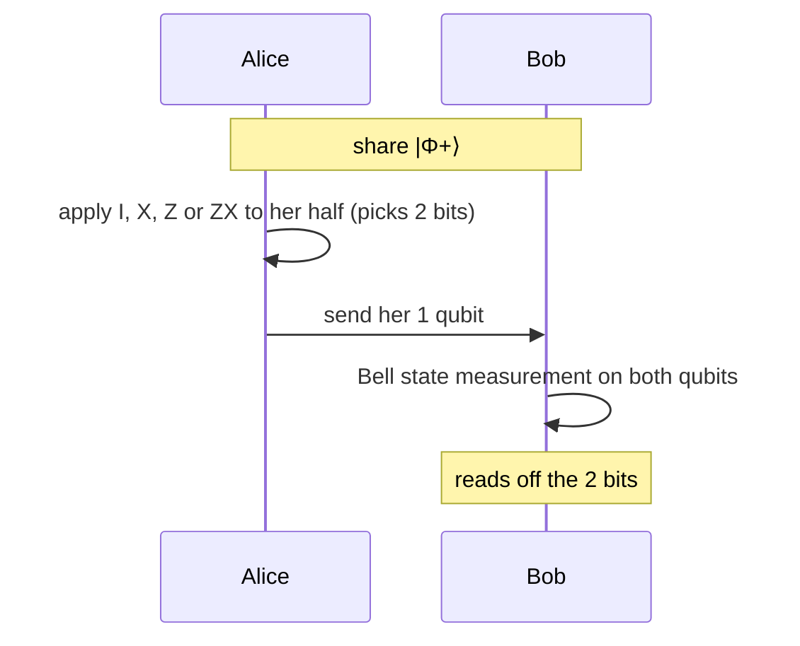

#extra #superdense_coding #entanglement #bell_states
**extra** (not in the course): send **2 classical bits** by sending just **1 qubit**, using a shared entangled pair. the reverse of [[Teleportation]]
## the setup
Alice and Bob already share a [[Bell states|Bell pair]]

![[Bell states#^bell-states]]

they start with $|\Phi^+\rangle$
## the protocol

| Alice's 2 bits | she applies | the pair becomes |
|---|---|---|
| 00 | nothing | $\lvert\Phi^+\rangle$ |
| 01 | [[X gate\|X]] | $\lvert\Psi^+\rangle$ |
| 10 | [[Z gate\|Z]] | $\lvert\Phi^-\rangle$ |
| 11 | $ZX$ | $\lvert\Psi^-\rangle$ |

the 4 results are the 4 Bell states, which are all **orthogonal**, so Bob can tell them apart perfectly with a Bell state measurement (a [[CNOT gate|CNOT]] then a [[Hadamard Gate|H]], then measure both). he gets the right 2 bits every time (checked numerically)
## why it doesn't break any rules
- a single qubit on its own can carry at most **1 classical bit** (the Holevo bound). superdense coding doesn't beat that: the other bit's worth was "pre-delivered" in the shared entanglement
- Eve intercepting Alice's qubit learns **nothing**: on its own it's half a Bell pair, which looks totally random whatever Alice did
## the resource trade

| protocol | uses | sends |
|---|---|---|
| **superdense coding** | 1 ebit + 1 qubit | 2 classical bits |
| **[[Teleportation]]** | 1 ebit + 2 classical bits | 1 qubit |

(an **ebit** = one shared Bell pair, see [[Entanglement as a resource]]). this is the "entanglement assisted capacity" idea in [[Channel capacity]]

see also [[Teleportation]], [[Bell states]], [[Entanglement as a resource]], [[Channel capacity]]
