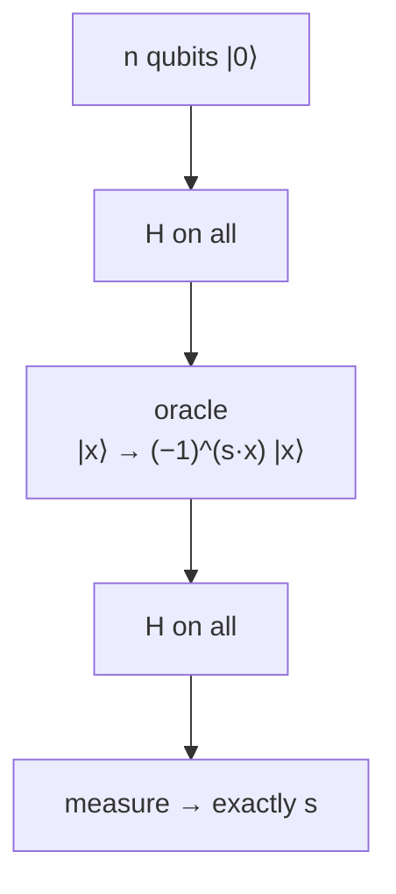

#extra #bernstein_vazirani #quantum_algorithm #oracle
**extra** (not in the course): find a secret bit string $s$ in **one** query, where a classical computer needs $n$. the idea behind [[Learning parity with noise]]
## the problem
a black box computes the **parity** of your input with a secret $n$ bit string $s$
$$
f(x)=s\cdot x=s_1x_1\oplus s_2x_2\oplus\ldots\oplus s_nx_n
$$
(the dot product mod 2). find $s$
- **classically**: ask $f(100\ldots0)=s_1$, then $f(010\ldots0)=s_2$, ... → $n$ queries, one bit each
- **quantum**: 1 query
## the circuit

1. [[Hadamard Gate|Hadamards]] → equal superposition of every $x$
2. the oracle puts a sign $(-1)^{s\cdot x}$ on each $|x\rangle$ (using [[Phase kickback|phase kickback]] with a helper in $|-\rangle$)
3. Hadamards again. the magic: that pattern of signs is **exactly** what $H^{\otimes n}|s\rangle$ looks like, so the Hadamards turn it back into $|s\rangle$
$$
H^{\otimes n}\,\frac1{\sqrt{2^n}}\sum_x(-1)^{s\cdot x}|x\rangle=|s\rangle
$$
> [!example] $s=101$
> after the circuit the qubits are in $|101\rangle$ with probability **1** (checked numerically)

## the family

| algorithm | what it finds | speedup |
|---|---|---|
| Deutsch–Jozsa | whether $f$ is constant or balanced | exponential (vs deterministic classical) |
| **Bernstein–Vazirani** | a hidden string $s$ with $f(x)=s\cdot x$ | $n$ queries → 1 |
| [[Simon's algorithm]] | a hidden XOR period $s$ | exponential |
| [[Shor's algorithm]] | a hidden period $r$ | exponential |

all of them are "Hadamards, oracle, Hadamards (or QFT), measure"
> [!note] the link to learning parity with noise
> with **noise** added to $f$, finding $s$ classically becomes really hard (that's the LPN problem), but the quantum version still works well. see [[Learning parity with noise]]

see also [[Learning parity with noise]], [[Simon's algorithm]], [[Phase kickback]]
