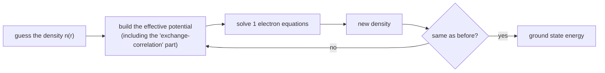

#extra #DFT #chemistry #classical_simulation
**extra** (not in the course): the most used method in computational chemistry and materials science. simulates way more atoms than exact methods, but only **approximately**. compare [[Quantum simulation]] and [[VQE]]
## the big idea
the exact state of $N$ electrons depends on $3N$ coordinates, so it's hopeless for big molecules. DFT works with the electron **density** $n(\vec r)$ instead: how many electrons are near each point in space. that's a function of just **3** coordinates, however many electrons there are
> [!important] Hohenberg–Kohn theorem (1964)
> ==the ground state electron density determines **everything** about the ground state (the energy, the wavefunction, all of it)==

(Walter Kohn shared the 1998 Nobel prize in chemistry for this)
## how it's done (Kohn–Sham, 1965)
replace the real interacting electrons with fake **non-interacting** ones that have the **same density**, moving in an effective potential. solve it over and over until it settles

## the catch
all the hard quantum many-body physics is hidden in one piece, the **exchange-correlation functional**, and nobody knows it exactly. people use approximations (with names like LDA, GGA, B3LYP)

| | DFT | exact methods (full CI) | [[VQE]] / quantum computers |
|---|---|---|---|
| cost | about $N^3$ (thousands of atoms) | exponential (tiny molecules) | polynomial (in principle) |
| accuracy | approximate | exact | can be exact |

> [!warning] where it fails
> **strongly correlated** systems, where electrons are tightly linked: breaking bonds, many transition metal compounds, some magnets and superconductors, and the iron-sulfur cluster in the enzyme behind nitrogen fixation. exactly the problems people hope quantum computers will crack (see [[Simulating quantum systems]])

see also [[Quantum simulation]], [[Simulating quantum systems]], [[VQE]], [[Tensor networks]]
