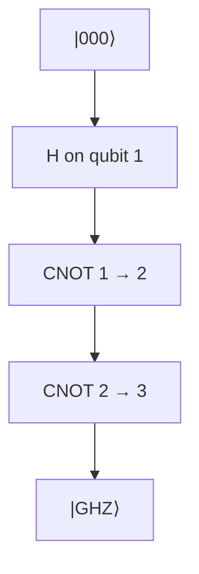

#extra #GHZ_state #entanglement #multipartite
**extra** (not in the course): the **3 (or more) qubit** version of a Bell state. named after Greenberger, Horne and Zeilinger
$$
|\text{GHZ}\rangle=\frac1{\sqrt2}\big(|000\rangle+|111\rangle\big)
$$
^ghz

(for $n$ qubits: $\frac1{\sqrt2}(|0\ldots0\rangle+|1\ldots1\rangle)$)
## making it

1 [[Hadamard Gate|Hadamard]] + $n-1$ [[CNOT gate|CNOTs]] (checked numerically). it's a common benchmark for new hardware: the bigger the GHZ state a machine can make well, the better (see [[Quantum volume]])
## properties
- measure **any one** qubit and all the others instantly match it: all 0s or all 1s
- it's **fragile**: lose (trace out) just **one** qubit and the rest become a plain classical mix
$$
\frac12\big(|00\rangle\langle00|+|11\rangle\langle11|\big)
$$
with **no** entanglement left (checked numerically, see [[Partial trace]]). so GHZ entanglement is "all or nothing"
## the GHZ paradox (Bell without inequalities)
for the GHZ state (checked numerically)
$$
\langle XXX\rangle=+1\qquad\langle XYY\rangle=\langle YXY\rangle=\langle YYX\rangle=-1
$$
> [!important] why this breaks local hidden variables in one shot
> suppose every qubit had pre-decided values $x_i,y_i=\pm1$ for what $X$ and $Y$ would give. then
> $$
> (x_1y_2y_3)(y_1x_2y_3)(y_1y_2x_3)=x_1x_2x_3\,(y_1y_2y_3)^2=x_1x_2x_3
> $$
> the left side is $(-1)^3=-1$, so hidden variables predict $XXX=-1$. quantum mechanics (and experiments) say $+1$
>
> unlike the [[CHSH game]], this isn't about statistics or beating 75%: hidden variables are wrong **every single time**

see also [[Bell states]], [[CHSH game]], [[Defining entanglement]], [[Quantum volume]]
