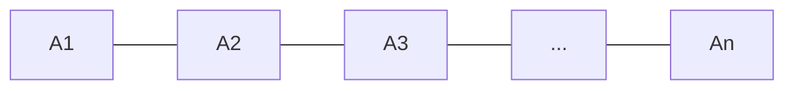

#extra #tensor_networks #classical_simulation #entanglement
**extra** (not in the course): a clever way to store and simulate quantum states on **classical** computers, by only keeping track of the entanglement that's actually there. one of the "clever tricks" in [[Quantum simulation]]
## the problem
a general state of $n$ qubits needs $2^n$ numbers. 50 qubits = about $10^{15}$ numbers (petabytes). that's the whole reason classical simulation fails ([[Hamiltonian]])
## the idea: matrix product states (MPS)
most physically realistic states (like low energy states of materials) are **not** fully entangled. entanglement mostly lives between **neighbours**. so write the big list of $2^n$ numbers as a **chain of small matrices**, one per qubit
$$
\psi_{i_1i_2\ldots i_n}=A^{[1]}_{i_1}A^{[2]}_{i_2}\cdots A^{[n]}_{i_n}
$$

each link between matrices has a size $\chi$, the **bond dimension**, and it limits how much [[Entanglement entropy|entanglement]] can cross that link (at most $\log_2\chi$ ebits)

| | numbers to store |
|---|---|
| full state | $2^n$ |
| MPS | about $n\cdot2\cdot\chi^2$ |

eg. 50 qubits with $\chi=64$: about $400{,}000$ numbers instead of $10^{15}$
![[Tensor_network_memory.png]]
## when it works (and when it doesn't)
- ✅ **low entanglement** states: ground states of 1D materials (the "area law"), shallow circuits. the method DMRG is hugely successful here
- ❌ **highly entangled** states: $\chi$ has to grow exponentially to keep up, and you're back to $2^n$
- in 2D and above there are fancier networks (PEPS, and MERA for critical systems), but they're harder to work with
> [!tip] the flip side
> tensor networks are the main way people **check** claims of quantum advantage: if a quantum computer's circuit can be simulated with a tensor network, it wasn't doing anything a classical computer couldn't. some past "quantum supremacy" experiments were later simulated this way

see also [[Quantum simulation]], [[Entanglement entropy]], [[Schmidt decomposition]], [[Density functional theory]]
