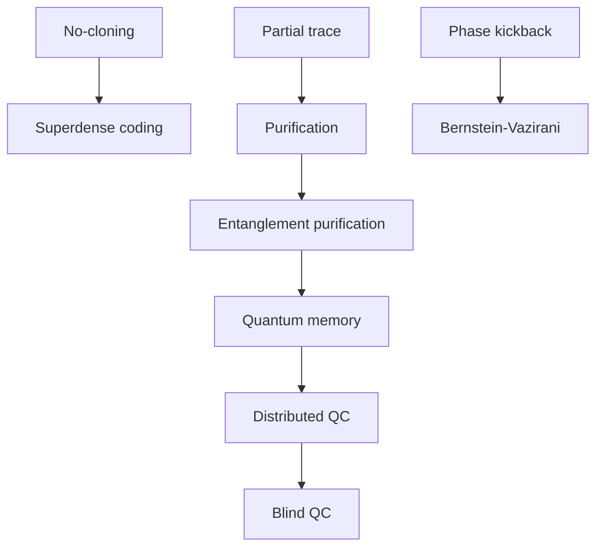

#extra
stuff that **isn't covered in the courses** but is still important or good to know. sorted by the course and week where it first comes up
## Course 1
- [[Fredkin gate]] → the controlled SWAP (and the swap test)
- [[Phase kickback]] → how a controlled gate changes the **control** qubit
## Course 2
- **week 2** → [[No-cloning theorem]] (you can't copy an unknown state, and why that matters everywhere)
## Course 3
- **week 1 (more channels)** → [[Pauli channel]] (the general one), [[Bit flip channel]], [[Bit-phase flip channel]], [[Phase damping channel]] (dephasing in disguise), [[Generalized amplitude damping channel]] (at a temperature), [[Erasure channel]] (lost, but you know it)
- **week 2 (entanglement and networks)** → [[Superdense coding]], [[Entanglement purification]], [[Quantum memory]], [[Distributed quantum computing]], [[Blind quantum computing]]
- **week 3 (algorithms and simulation)** → [[Bernstein-Vazirani algorithm]], [[GHZ state]], [[Solovay-Kitaev theorem]], [[Tensor networks]], [[Density functional theory]]
- **week 4 (maths behind fidelity)** → [[Partial trace]], [[Purification]]

(some rough "read this first" links)

see also [[Welcome]], [[Math]]
