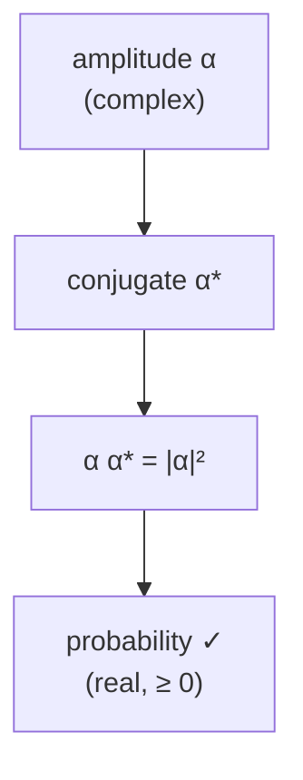

#math #complex_numbers
quantum states use complex numbers for their amplitudes, so you need these for basically everything
## what they are
$$
z=a+bi\qquad i=\sqrt{-1}\quad(i^2=-1)
$$
- $a$ is the **real** part
- $b$ is the **imaginary** part

you can draw it as a point (or arrow) on a 2D plane: real across, imaginary up

![[Complex_plane.png]]
## the important bits
### size (magnitude)
$$
|z|=\sqrt{a^2+b^2}
$$
how long the arrow is
### conjugate
flip the sign of the imaginary part (mirror it across the real axis)
$$
z^*=a-bi
$$
> [!important] the trick you'll use the most
> $$
> z\,z^*=|z|^2=a^2+b^2
> $$
> this is always a **real, positive** number. it's how you turn an amplitude into a **probability**: if a qubit is $\alpha|0\rangle+\beta|1\rangle$ then
> $$
> P(0)=|\alpha|^2=\alpha\alpha^*\qquad P(1)=|\beta|^2=\beta\beta^*
> $$
### phases $e^{i\varphi}$
$$
e^{i\varphi}=\cos\varphi+i\sin\varphi
$$
- always has size $|e^{i\varphi}|=1$, it's on the unit circle
- multiplying by it just **turns** a number by angle $\varphi$ without changing its size
- $e^{i\pi}=-1$, $e^{i\pi/2}=i$, $e^{i2\pi}=1$

any complex number can be written as $z=|z|\,e^{i\varphi}$ (a size and an angle)

(from amplitude to probability)

## where it shows up
- **amplitudes** of a qubit, eg. $\frac1{\sqrt2}(|0\rangle+i|1\rangle)$ (that's $|{+i}\rangle$ on the [[Bloch sphere]])
- **phase gates** like the [[Z gate]] ($e^{i\pi}=-1$) and [[Phase shift]] ($e^{i\varphi}$)
- the $\varphi$ angle of the [[Bloch sphere]]
- the $\omega=e^{2\pi i/N}$ in the [[Quantum Fourier Transform]]
- the [[Y gate]] has $i$ in its matrix
- the $\dagger$ in [[Unitary Operation|unitaries]] means conjugate **and** transpose

> [!note] global phase doesn't matter
> multiplying the **whole** state by $e^{i\varphi}$ changes nothing you can measure, because $|e^{i\varphi}\alpha|^2=|\alpha|^2$. only **relative** phases (between the $|0\rangle$ and $|1\rangle$ parts) matter

see also [[Math/Dirac notation]], [[Math]]
