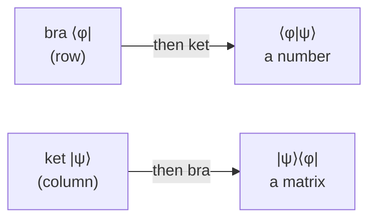

#math #dirac_notation #linear_algebra
the $|\psi\rangle$ and $\langle\psi|$ symbols, it's just a shorthand for vectors
## kets $|\psi\rangle$
a **ket** is a **column** vector (a quantum state)
$$
|0\rangle=\begin{bmatrix}1\\0\end{bmatrix}\qquad|1\rangle=\begin{bmatrix}0\\1\end{bmatrix}\qquad\alpha|0\rangle+\beta|1\rangle=\begin{bmatrix}\alpha\\\beta\end{bmatrix}
$$
## bras $\langle\psi|$
a **bra** is the **row** version, with every number [[Complex numbers|conjugated]]
$$
|\psi\rangle=\begin{bmatrix}\alpha\\\beta\end{bmatrix}\quad\longrightarrow\quad\langle\psi|=\begin{bmatrix}\alpha^*&\beta^*\end{bmatrix}
$$
(bra + ket = "bra-ket" = bracket, that's where the names come from)
## inner product $\langle\phi|\psi\rangle$ (bra then ket)
row × column = **one number**. it tells you how much 2 states **overlap**
$$
\langle\phi|\psi\rangle=\phi_0^*\psi_0+\phi_1^*\psi_1
$$
- $\langle\psi|\psi\rangle=1$ → every state has length 1 (normalized)
- $\langle\phi|\psi\rangle=0$ → the states are **orthogonal**, you can tell them apart perfectly. eg. $\langle0|1\rangle=0$, $\langle+|-\rangle=0$

> [!important] the probability rule
> if you have $|\psi\rangle$ and measure in a basis that has $|\phi\rangle$ in it
> $$
> P(\phi)=|\langle\phi|\psi\rangle|^2
> $$
> eg. $|\langle0|+\rangle|^2=\left|\frac1{\sqrt2}\right|^2=\frac12$, so measuring $|+\rangle$ gives $0$ half the time
## outer product $|\psi\rangle\langle\phi|$ (ket then bra)
column × row = a **matrix**
$$
|0\rangle\langle0|=\begin{bmatrix}1&0\\0&0\end{bmatrix}\qquad|0\rangle\langle1|=\begin{bmatrix}0&1\\0&0\end{bmatrix}
$$
this is what the [[Density matrix]] is built from: $\rho=\sum_kp_k|\psi_k\rangle\langle\psi_k|$

(trick: $|i\rangle\langle j|$ puts a 1 in row $i$, column $j$)
## sandwiches $\langle\psi|A|\psi\rangle$
bra × matrix × ket = one number. it's the **average result** (expectation value) if you measure $A$ on $|\psi\rangle$, see [[Probability and expectation values]]

## cheat sheet
| you see | it is | size |
|---|---|---|
| $\lvert\psi\rangle$ | column vector | state |
| $\langle\psi\rvert$ | row vector (conjugated) | state |
| $\langle\phi\vert\psi\rangle$ | inner product | a number |
| $\lvert\psi\rangle\langle\phi\rvert$ | outer product | a matrix |
| $\langle\psi\rvert A\lvert\psi\rangle$ | expectation value | a number |
| $\lvert01\rangle$ | $\lvert0\rangle\otimes\lvert1\rangle$ | 2 qubit state, see [[Tensor product]] |

see also [[Complex numbers]], [[Math]]
