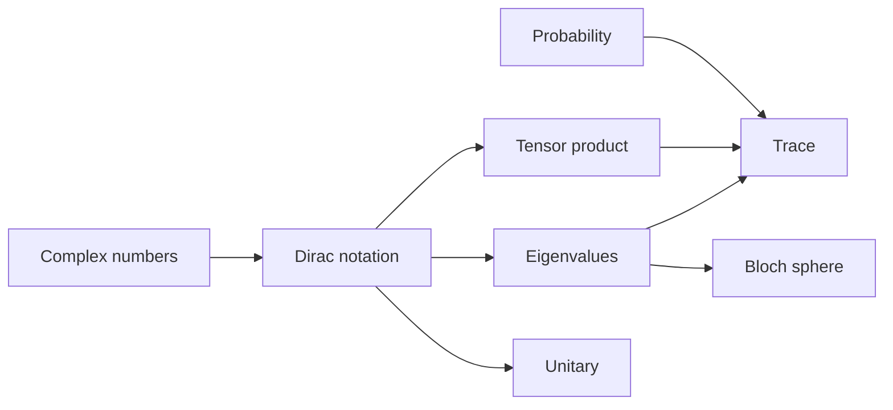

#math
the maths you need for the quantum notes. start at the top if something doesn't make sense
## the basics
- [[Complex numbers]] → $i$, conjugates, $|z|^2$, phases $e^{i\varphi}$
- [[Dirac notation]] → kets $|\psi\rangle$, bras $\langle\psi|$, inner and outer products
- [[Probability and expectation values]] → distributions, averages $\langle x\rangle$, $\log_2$
- [[Modular arithmetic]] → mod $N$, XOR, periods, gcd
## linear algebra
- [[Eigenvalues and eigenvectors]] → the directions a matrix only stretches
- [[Tensor product]] → combining qubits with $\otimes$, entanglement
- [[Trace]] → tr, purity, the partial trace
- [[Unitary Operation]] → $U^\dagger U=I$, what every gate is
## pictures and transforms
- [[Bloch sphere]] → drawing a qubit as a point on a sphere
- [[Fourier Transform]], [[Discrete Fourier Transform]] → splitting a signal into frequencies (used in the [[Quantum Fourier Transform]])

(arrows = "learn this first")

see also [[Welcome]]
