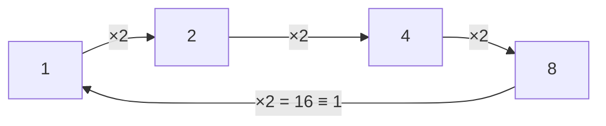

#math #modular_arithmetic #XOR
"clock maths": you wrap around when you hit $N$
## what mod means
$a\bmod N$ = the **remainder** when you divide $a$ by $N$
$$
17\bmod5=2\qquad16\bmod15=1\qquad8\bmod2=0
$$
like a clock with $N$ hours: after $N-1$ you go back to $0$

![[Mod_clock.png]]

$a\equiv b\pmod N$ means $a$ and $b$ land on the same spot on the clock (eg. $16\equiv1\pmod{15}$)
## mod 2 and XOR
mod 2 only has 0 and 1, and adding in mod 2 is the same as **XOR** ($\oplus$)

| $x$ | $y$ | $x\oplus y$ |
|---|---|---|
| 0 | 0 | 0 |
| 0 | 1 | 1 |
| 1 | 0 | 1 |
| 1 | 1 | 0 |

$x\oplus y=1$ means "$x$ and $y$ are **different**"

used in
- the [[CHSH game]] (win if $x\oplus y=a\cdot b$)
- the [[CNOT gate]] (target becomes target $\oplus$ control)
- the proof that CHSH can't be won 100% ($2x\equiv0\pmod2$)
## mod N and periods
keep multiplying by $a$ in mod $N$ and it eventually **repeats**. the number of steps before it repeats is the **period** (or **order**) $r$

eg. $a=2,\ N=15$: $1\to2\to4\to8\to16\equiv1$, so $r=4$

this is exactly what the [[Order finding algorithm]] finds, and it's the heart of [[Shor's algorithm]] (using [[Modular Exponentiation]])

## gcd
$\gcd(a,N)$ = the biggest number that divides both. [[Shor's algorithm]] needs $\gcd(a,N)=1$, and at the end it uses $\gcd(a^{r/2}\pm1,\,N)$ to get the factors

eg. $\gcd(2^2-1,15)=\gcd(3,15)=3$ and $\gcd(2^2+1,15)=\gcd(5,15)=5$, and $3\times5=15$ ✅

see also [[Math]]
