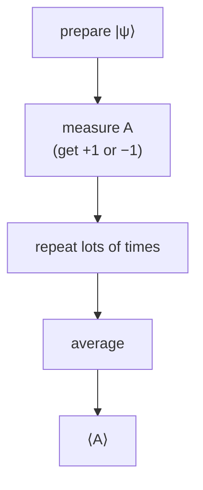

#math #probability #expectation_value
## probability distributions
a list of outcomes and how likely each one is. all the probabilities are between 0 and 1 and **add up to 1**
$$
\sum_xp(x)=1
$$
eg. a fair coin: $p(0)=\frac12,\ p(1)=\frac12$
## expected value (average)
what you get **on average** if you repeat something lots of times
$$
\langle x\rangle=\sum_x x\,p(x)
$$
eg. a result that's $+1$ with probability $\frac34$ and $-1$ with probability $\frac14$
$$
\langle x\rangle=(+1)\tfrac34+(-1)\tfrac14=\tfrac12
$$
(the angle brackets $\langle\;\rangle$ mean "average", like the ensemble average in [[Noise power spectral density]])
## quantum expectation values
measuring an observable $A$ (like $\sigma_z$) on a state $|\psi\rangle$, the average result is
$$
\langle A\rangle=\langle\psi|A|\psi\rangle=\text{tr}(\rho A)
$$
> [!example] $\sigma_z$ on a few states
> $\sigma_z$ gives $+1$ for $|0\rangle$ and $-1$ for $|1\rangle$ (its [[Eigenvalues and eigenvectors|eigenvalues]])
> - $|0\rangle$ → always $+1$ → $\langle\sigma_z\rangle=+1$
> - $|1\rangle$ → always $-1$ → $\langle\sigma_z\rangle=-1$
> - $|+\rangle$ → half $+1$ half $-1$ → $\langle\sigma_z\rangle=0$
>
> this is exactly the $\langle Z\rangle$ that goes up and down in a [[Rabi oscillation]]

## log₂
used in [[Shannon entropy]] and [[Von Neumann entropy]]. $\log_2x$ asks "2 to the power of **what** gives $x$?"

| $x$ | $\log_2x$ |
|---|---|
| 8 | 3 |
| 2 | 1 |
| 1 | 0 |
| $\frac12$ | $-1$ |
| $\frac14$ | $-2$ |

probabilities are $\leq1$ so their logs are $\leq0$, that's why entropy has a **minus sign**: $H=-\sum p\log_2p$ comes out positive

eg. fair coin: $H=-\left(\frac12(-1)+\frac12(-1)\right)=1$ bit

see also [[Math]]
