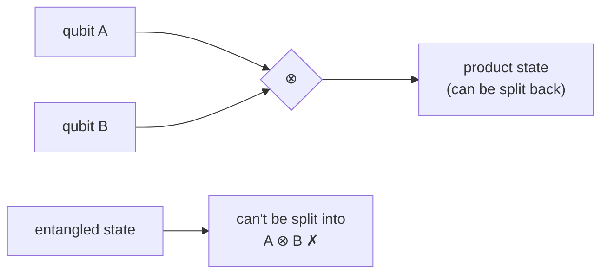

#math #tensor_product #linear_algebra #entanglement
how you combine qubits into one bigger state. the $\otimes$ symbol
## for states
$$
|0\rangle\otimes|1\rangle=|0\rangle|1\rangle=|01\rangle
$$
to actually multiply it out: **each number in the first vector times the whole second vector**
$$
\begin{bmatrix}a\\b\end{bmatrix}\otimes\begin{bmatrix}c\\d\end{bmatrix}=\begin{bmatrix}a\begin{bmatrix}c\\d\end{bmatrix}\\b\begin{bmatrix}c\\d\end{bmatrix}\end{bmatrix}=\begin{bmatrix}ac\\ad\\bc\\bd\end{bmatrix}
$$
eg.
$$
|0\rangle\otimes|1\rangle=\begin{bmatrix}1\\0\end{bmatrix}\otimes\begin{bmatrix}0\\1\end{bmatrix}=\begin{bmatrix}0\\1\\0\\0\end{bmatrix}=|01\rangle
$$
the 4 spots are $|00\rangle,|01\rangle,|10\rangle,|11\rangle$ in that order
> [!important] sizes multiply
> - 1 qubit → 2 numbers
> - 2 qubits → $2\times2=4$ numbers
> - $n$ qubits → $2^n$ numbers
>
> that's why a [[CNOT gate]] is $4\times4$ and a [[Toffoli gate]] is $8\times8$
## for gates
same idea with matrices: $A\otimes B$ means "do $A$ on the first qubit and $B$ on the second"

eg. [[Hadamard Gate|H]] on qubit 1 and nothing on qubit 2 is $H\otimes I$

## entanglement
> [!important] entangled = can't be split
> ==some 2 qubit states **can** be written as (qubit 1) $\otimes$ (qubit 2), like $|0\rangle\otimes|+\rangle$.== these are **product states**
>
> but some **can't**, like
> $$
> \frac1{\sqrt2}(|00\rangle+|11\rangle)
> $$
> there's no way to write this as one state $\otimes$ another. those are **entangled** states (see [[Quantum weirdness]])

see also [[Dirac notation]], [[Trace]] (the partial trace undoes the tensor product), [[Math]]
