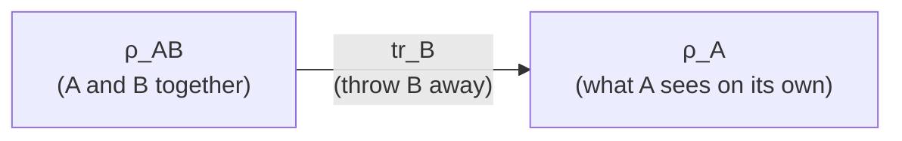

#math #trace #partial_trace #density_matrix
## the trace
add up the numbers on the **diagonal** of a matrix
$$
\text{tr}\begin{bmatrix}a&b\\c&d\end{bmatrix}=a+d
$$
also = the sum of the [[Eigenvalues and eigenvectors|eigenvalues]]
## where it shows up
### $\text{tr}(\rho)=1$
for a [[Density matrix]] the diagonal is the **probabilities** of $|0\rangle$ and $|1\rangle$, so they have to add to 1

eg. $\text{tr}\begin{bmatrix}\frac34&0\\0&\frac14\end{bmatrix}=\frac34+\frac14=1$
### purity $\text{tr}(\rho^2)$
- $=1$ → pure state
- $<1$ → mixed state
- $=\frac12$ → fully mixed $\frac I2$ (the middle of the [[Bloch sphere]])

(see [[Quantum channels#what the Bloch sphere squishing actually means]])
### expectation values
$\langle A\rangle=\text{tr}(\rho A)$ is the average result of measuring $A$, see [[Probability and expectation values]]
### von Neumann entropy
$S(\rho)=-\text{tr}(\rho\log_2\rho)$, see [[Von Neumann entropy]]

## the partial trace
for a 2 part state (A and B), the **[[Partial trace|partial trace]]** $\text{tr}_B$ throws away B and tells you what's left for A
$$
\rho_A=\text{tr}_B\big(\rho_{AB}\big)
$$
how to do it: keep A's labels, and only keep the terms where B's ket and bra **match** ($\langle0|0\rangle=1$, $\langle0|1\rangle=0$)

> [!example]- example: half of a Bell pair
> $$
> |\psi\rangle=\frac1{\sqrt2}(|00\rangle+|11\rangle)
> $$
> $$
> \rho_{AB}=\frac12\big(|00\rangle\langle00|+|00\rangle\langle11|+|11\rangle\langle00|+|11\rangle\langle11|\big)
> $$
> trace out B: the middle 2 terms have B going $0\to1$ or $1\to0$ so they vanish
> $$
> \rho_A=\frac12\big(|0\rangle\langle0|+|1\rangle\langle1|\big)=\frac I2
> $$
> so A on its own is **fully mixed**, even though the whole thing is a pure state. that's entanglement (and it's the [[Density matrix#purification|purification]] idea)

see also [[Density matrix]], [[Tensor product]], [[Math]]
