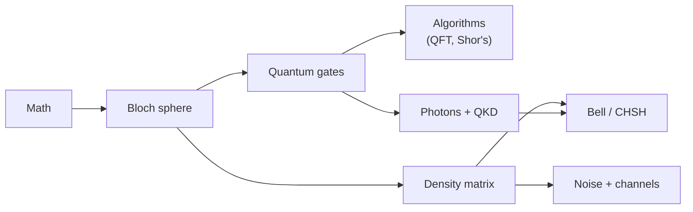

# Welcome 
these are my notes from three **MIT xPRO** quantum computing courses. I wrote them while taking the courses, so they're written the way I understood things, with lots of pictures and worked examples

![[Bloch_sphere.png|400]]

> [!info] what's in here
> - **Course 1** → *Introduction to Quantum Computing*: qubits, the Bloch sphere, quantum gates
> - **Course 2** → *Quantum Algorithms for Cybersecurity, Chemistry, and Optimization*: cryptography and Shor's algorithm, photons and quantum key distribution, simulating molecules, quantum optimisation and Grover
> - **Course 3** → *Practical Realities of Quantum Computation and Quantum Communication*: density matrices, noise, quantum channels, information theory, Bell and the CHSH game
> - **Math** → all the maths you need for the rest

## where to start
pick whatever sounds interesting, every note links to the ones it builds on

| if you want... | start here | then |
|---|---|---|
| the basics of qubits | [[Bloch sphere]] | [[Quantum gate]] → [[Hadamard Gate]] → [[CNOT gate]] |
| the maths | [[Math]] | [[Dirac notation]] → [[Eigenvalues and eigenvectors]] |
| quantum algorithms | [[Quantum Fourier Transform]] | [[Quantum Phase Estimation]] → [[Shor's algorithm]] |
| quantum cryptography | [[Modern cryptography]] | [[RSA]] → [[QKD]] → [[BB84]] → [[Ekert91]] |
| simulating molecules | [[Simulating quantum systems]] | [[Hamiltonian]] → [[Trotterization]] → [[VQE]] |
| optimisation | [[Quantum optimization]] | [[Adiabatic quantum computing]] → [[QAOA]] → [[Grover's algorithm]] |
| why real quantum computers are hard | [[Density matrix]] | [[Quantum channels]] → [[Noise Processes]] |
| the weird stuff | [[Quantum weirdness]] | [[CHSH game]] → [[CHSH quantum strategy]] |
| information theory | [[Quantum Communication]] | [[Shannon entropy]] → [[Von Neumann entropy]] |

(a rough order if you want to go through everything)
## all the courses
### Course 1: Introduction to Quantum Computing
- [[Quantum gate]] → every gate, single qubit and multi qubit
- [[Bloch sphere]] and [[Unitary Operation]]
### Course 2: Quantum Algorithms for Cybersecurity, Chemistry, and Optimization
- **week 1** → [[Modern cryptography]], [[RSA]], [[Fourier Transform]], [[Discrete Fourier Transform]], [[Quantum Fourier Transform]], [[Modular Exponentiation]], [[Order finding algorithm]], [[Quantum Phase Estimation]], [[Shor's algorithm]], [[Simon's algorithm]]
- **week 2** → [[Post-quantum cryptography]], [[Polarization]], [[Beamsplitters]], [[Single Photon making and detecting]], [[Entangled Photons generation and detection]], [[Bell states]], [[QKD]], [[Quantum random number generators]], [[One-time pad]], [[Teleportation]]
- **week 3** → [[Simulating quantum systems]] ([[Hamiltonian]], [[Particle in a box]], [[Hamiltonian simulation]], [[Trotterization]], [[VQE]])
- **week 4** → [[Quantum optimization]] ([[Adiabatic quantum computing]], [[Quantum annealing]], [[QAOA]], [[Grover's algorithm]], [[QASM]])
### Course 3: Practical Realities of Quantum Computation and Quantum Communication
- **week 1** → [[Density matrix]], [[Quantum channels]], [[Noise Processes]], [[Quantum Error Correction]]
- **week 2** → [[Quantum Communication]] (information theory, EPR, Bell and CHSH)
- **week 3** → [[Realistic quantum computation]] (the [[NISQ]] era)
- **week 4** → [[Benchmarking quantum systems]] (tomography and randomized benchmarking)
### Math
- [[Math]] → complex numbers, Dirac notation, probability, modular arithmetic, eigenvalues, tensor products, the trace
## tips for reading
- **click any link** to jump to that note, or **hover** over it for a quick preview
- the **graph view** shows how all the notes connect
- the collapsible boxes (the ones with an arrow ▸) hide proofs and extra details, click to open them
- the notes are in my own words and not official MIT material, so if something looks wrong it's my mistake, not the course's

> [!note] more
> - the same notes on GitHub: [ArhamAkhtarAlam/mitxpro-my-notes](https://github.com/ArhamAkhtarAlam/mitxpro-my-notes)
> - licensed under [CC BY 4.0](https://creativecommons.org/licenses/by/4.0/): share and reuse them however you like, just give credit
> - all the pictures were made by me (Python and [Qiskit](https://www.qiskit.org/))
